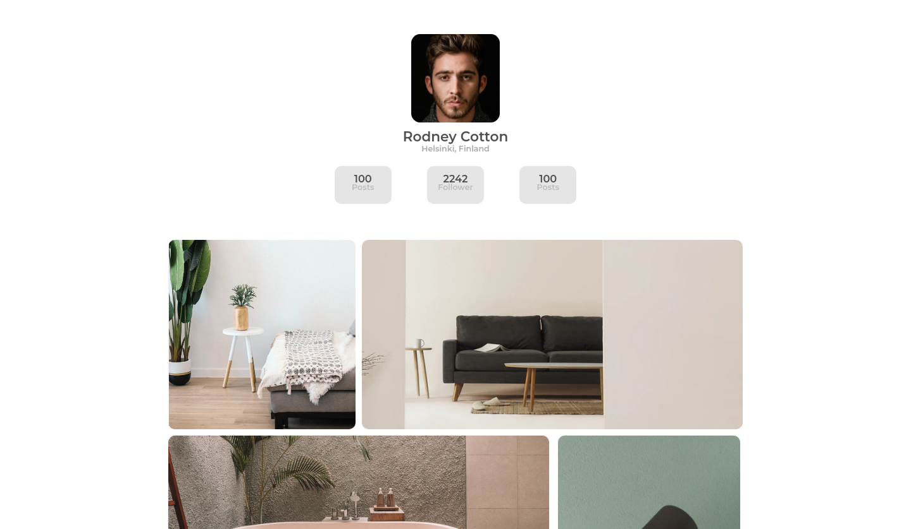

<!-- Please update value in the {}  -->

<h1 align="center">{My Gallery}</h1>

   Solution for a challenge from  <a href="http://devchallenges.io" target="_blank">Devchallenges.io</a>.

  <h3>
    <a href="https://dogallery.surge.sh">
      Demo
    </a>
     | 
    <a href="https://github.com/DoIfeanyichukwu/my-gallery">
      Solution
    </a>
     | 
    <a href="https://devchallenges.io/challenges/gcbWLxG6wdennelX7b8I">
      Challenge
    </a>
  </h3>

<!-- TABLE OF CONTENTS -->

## Table of Contents

- [Overview](#overview)
  - [Built With](#built-with)
- [Features](#features)
- [Contact](#contact)
- [Acknowledgements](#acknowledgements)

<!-- OVERVIEW -->

## Overview

The images section was done with CSS grids

- Where can I see your demo?
  - [demo](https://dogallery.surge.sh)
- What have you learned/improved?
  - improved my knowledge of CSS grids and image handling
- Your wisdom? :)
  - Do, and do some more.

### Built With

<!-- This section should list any major frameworks that you built your project using. Here are a few examples.-->

HTML 
CSS
## Features

This application/site was created as a submission to a [DevChallenges](https://devchallenges.io/challenges) challenge. The [challenge](https://devchallenges.io/challenges/gcbWLxG6wdennelX7b8I) was to build an application to complete the given user stories.

## Acknowledgements

- [Steps to replicate a design with only HTML and CSS](https://devchallenges-blogs.web.app/how-to-replicate-design/)
- [Node.js](https://nodejs.org/)
- [Marked - a markdown parser](https://github.com/chjj/marked)

## Contact

- GitHub [@DoIfeanyichukwu](https://github.com/DoIfeanyichukwu)
- Twitter [@DoIfeanyichukwu](https://twitter.com/DoIfeanyichukwu)
